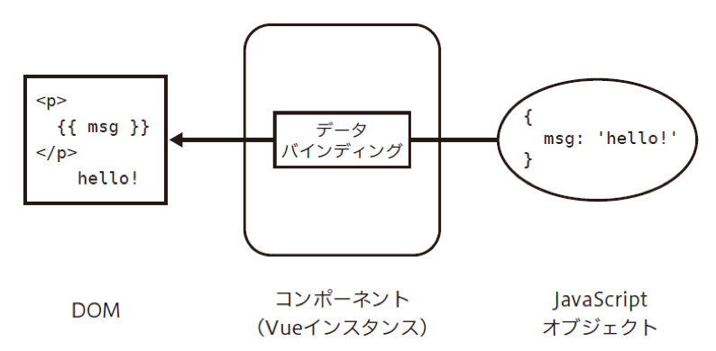
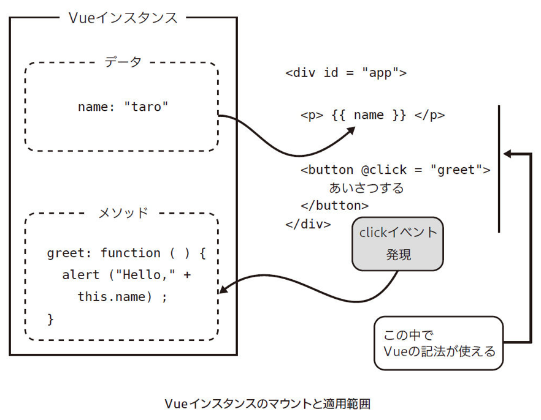
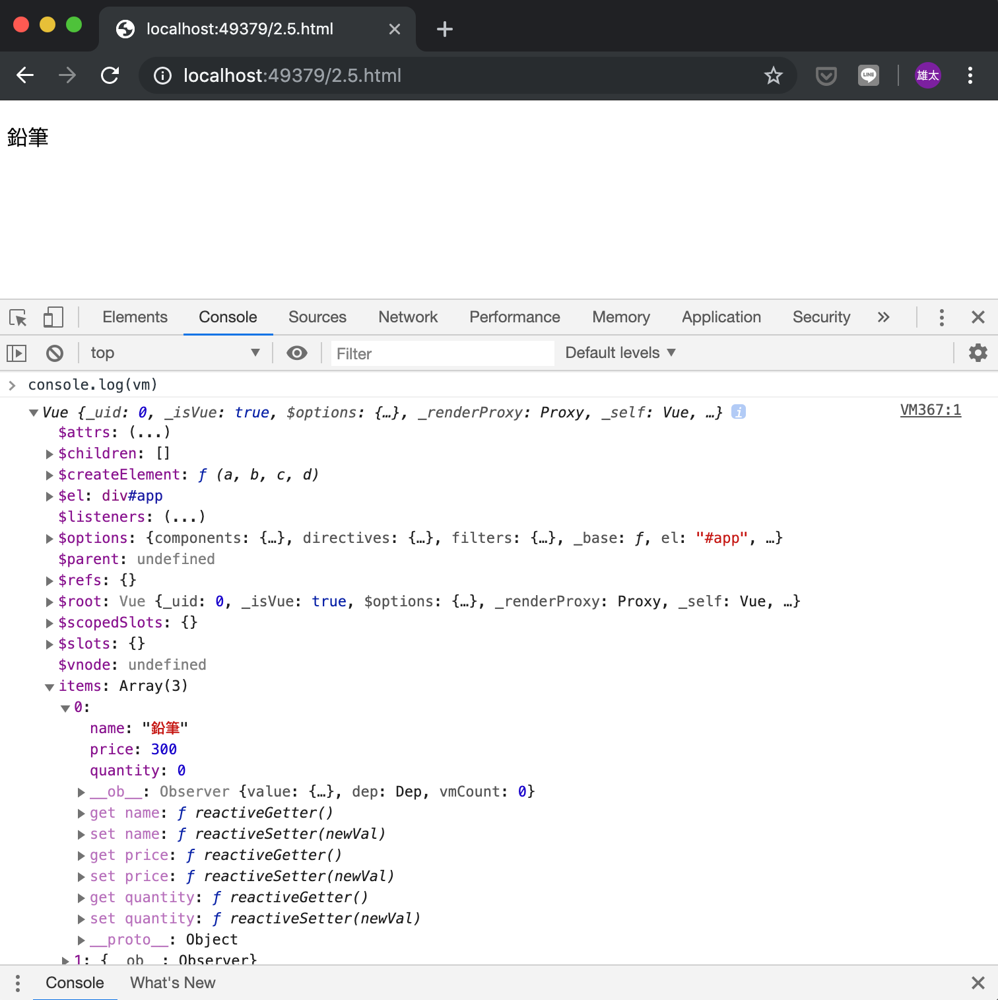
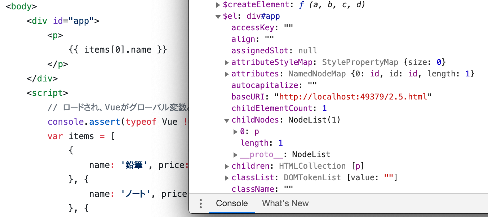
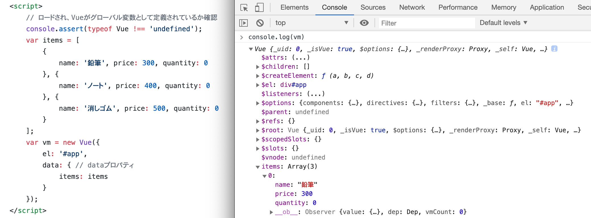
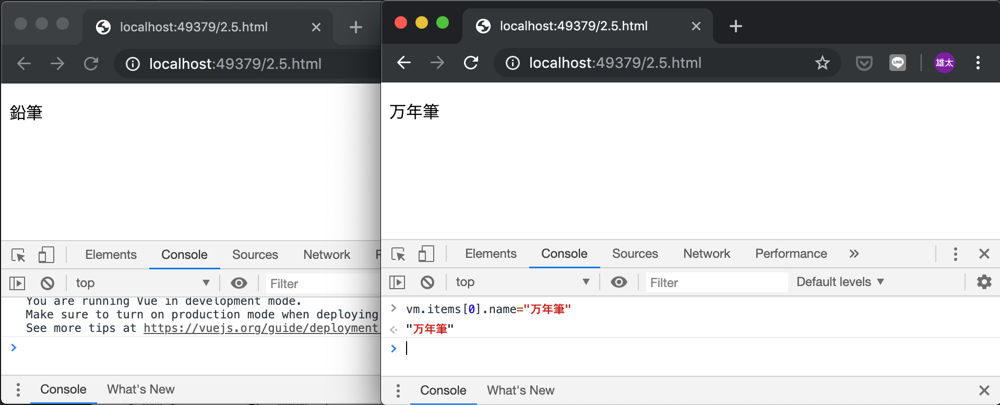

# 2章
# Vue.jsの基本

---

## *はじめに*

### *注意事項*

- *このリポジトリは[[秋葉原] Vue.js入門 輪読会 2章 Vue.jsの基礎 (初心者歓迎！)](https://weeyble-js.connpass.com/event/131771/)の発表資料として用意したリポジトリです。*
- *書籍の要約は正体、担当者の理解で書いているところは斜体で記載しています。*
- *権利関係で問題があれば、対応するのでご指摘ください。*

---

## 2章 Vue.jsの基本

--

- 「文房具の購入フォーム」の作成を通して、Vue.jsの基本的な機能をマスターする。
- Vue.jsでのUIを構成する３要素
  + データ
  + データを画面に表示するビュー
  + データを変更するユーザのアクション

---

## 2.1 Vue.jsでUIを構築する際の考え方

--

- jQueryのコーディングスタイルからVue.jsのコーディングスタイルへ頭を切り替える必要がある

--


--

||jQuery|Vue.js|
|---|---|---|
|特徴|イベントリスナーが自身や他のDOM要素を操作|イベントと要素の間に「UIの状態」（state）が挟まる|
|イベントや要素の増加による影響|イベントの要素にどのような影響を与えるか、イベントと要素の組み合わせを意識する必要がある|イベントによるUIの状態の変更、それに伴うDOMツリーやDOM要素の更新に分けて単純に考えることができる|

--

||jQuery|Vue.js|
|---|---|---|
|コーディングスタイル|**DOMツリーを中心に捉える。**DOMツリーがUIの状態を持っており、イベントによってDOMツリーをどのように変更するか考える|**UIの構築を担うJavaScriptのオブジェクト(仮想DOM)を中心に捉える。**データ、ビュー、アクションという3つの視点を切り替えながら、UIの構築を進めていく|

--

### 参考

- [なぜ仮想DOMという概念が俺達の魂を震えさせるのか](https://qiita.com/mizchi/items/4d25bc26def1719d52e6)
  + 仮想DOMとは何か、なぜ仮想DOMか
  + Fluxとは何か、なぜ今Fluxか
  + *フロントエンドのパラダイムシフトの概要を抑えられてわかりやすい。（Vueの話はない）*
- [mozaic.fm ep13 Virtual DOM](https://mozaic.fm/episodes/13/virtual-dom.html)
  + 上の記事を踏まえたPodcast

---

## 2.2 Vue.jsの導入

--

- script要素で直接Vue.jsを読み込んで、Vue.jsのデータバインディングを体感する
  + バインディング: JavaScriptのデータとDOM要素を結びつけること（1.2.3参照）  
  
- [サンプルコード](https://github.com/yasugahira0810/Vue.js_chapter2/blob/master/2.2.html), [デモ](2.2.html)

--

### Column Vue.jsの高度な環境構築

- 本章はVue.jsの基本機能の利用のみなので、script要素でライブラリを直接読み込む簡易な開発方法を用いた。
- SPAなど複数ファイルで構成されるアプリを開発する場合は、webpackなどのバンドルツールを利用すべき。
- Vue CLIを用いると高度な環境を比較的簡単に構築できる。Vue CLIは6章で紹介する。

---

## 2.3 Vueオブジェクト

--

- Vue.jsのファイルを読み込むとグローバル変数Vueが定義される
- グローバル変数Vueは複数の役割を持ったオブジェクト
  + Vueインスタンスを生成する**コンストラクタ**  
    => 2.3.1で説明
  + Vue.jsのAPIを束ねる名前空間（**モジュール**）  
    => 2.3.2で説明

--

### 2.3.1 コンストラクタ

- JSではコンストラクタはオブジェクトを生成するための関数
- 通常の関数呼び出しと異なりnew演算子を使う
- 生成されたオブジェクトが**Vueインスタンス**
- DOMにマウントすることでVueの機能が使える


--

- Vueインスタンスの生成例（2.2からの再掲）
```js
        new Vue({
            el: '#app',
            data: {
                message: 'こんにちは!'
            }
        });
```

- 「el」や「data」はコンストラクタの引数で、オプションオブジェクトという
- オプションオブジェクトの内容によってVueインスタンスやUIの挙動が決まる
- 本節で主要なオプションを扱う（次スライド）

--

|オプション名|内容|紹介箇所|
|------|------|------|
|data|UIの状態・データ|2.5|
|el|Vueインスタンスを、マウントする要素|2.4|
|filters|データを文字列と整形する|2.7|
|methods|イベント発生時などの振舞い|2.10|
|computed|データから派生した算出値|2.8|

- <span style="font-size: 60%">*オプション名がこの後「elプロパティ」のように言い換えられるので注意*</span>
- <span style="font-size: 60%">*オプションとプロパティはほぼ同じもののように見える。。。*</span>

--

- *[2.11のVueインスタンスの定義](https://github.com/yasugahira0810/Vue.js_chapter2/blob/master/2.11.html)は全部使ってるので覗いてみよう！*

--

### Vueインスタンスを変数に代入する理由は？

- 本節では説明の都合上変数に代入しているが、代入せずに用いることも可能
- 実際の開発では、複数のVueインスタンスがコミュニケーションする際に変数に代入する
- *SNSの例はよくわからないので説明省略。気にしなくていいと思う。*
- サンプルの変数名vmはMVVMパターンのViewModelが由来

--

### Column MVVMパターン

- ソフトウェアアーキテクチャパターンの一種
  + M: ビジネスロジックや内部の処理を担うModel
  + V: レイアウトや見た目を担うView
  + VM: View向けの状態の管理を担うViewModel
- 本書では詳細な解説はしない

--

### 2.3.2 コンポーネント

- Vue.jsでも先ほどのVueインスタンスを分割できる
  + プログラミングにおいて関数を適切な粒度・役割で分割するのと同様
- この分割単位を**コンポーネント**と呼ぶ
  + Vueオブジェクトのcomponentメソッドでアプリ全体で使うコンポーネントを登録可能
  + Vueインスタンス生成時のオプションのcomponentsプロパティで、そのVueインスタンスのスコープだけで利用できるコンポーネントを登録可能（*意味がわからないよ。。。*）
  + 次章で説明（*だそうなので、気にせず進もう*）

---

## 2.4 Vueインスタンスのマウント

--

- Vue.jsの処理は、2.3で説明したVueインスタンスをDOM要素にマウントするところから始まる
  + マウント: 既存のDOM要素をVue.jsが生成するDOM要素で置き換えること


--

- 本節では2通りのDOM要素の指定方法を紹介
  + 2.4.1 インスタンス生成時にelプロパティで与える方法
  + 2.4.2 $mountメソッドを呼び出して後から指定する方法


--

### 2.4.1 Vueインスタンスの適用（el）

- オプションオブジェクトのelプロパティで指定したDOM要素がマウント対象になる
- elプロパティにはDOM要素のオブジェクトかCSSセレクタの文字列を指定できる
- マウントするとマウントした要素とその子孫が置き換えられる
- 従ってVue.jsの機能はマウントする要素とその子孫でのみ有効になる

--

- 前提: elプロパティで#appが指定されている

- *また[2.11のサンプル](https://github.com/yasugahira0810/Vue.js_chapter2/blob/master/2.11.html)見て感覚を掴もう！*

--

### 2.4.2 メソッドによるマウント（$mountメソッド）

- Vueインスタンス生成時にelプロパティを定義せずとも、$mountメソッドでマウントができる
- マウント対象のDOM要素がUI操作や通信などで遅延的に追加される場合に使う

--

### Column Vue.jsを既存アプリケーションに導入する

- 既存アプリへの導入時もDOM要素を作成してマウントするところは同じ
- 既存アプリのテンプレートエンジンによっては、Vue.jsのシンタックスシュガー（@click, :disabled など）が使えないので、その場合は正式な書き方で記述する

---

## 2.5 UIのデータ定義（data）

--

### dataプロパティ

- UIの状態となるデータのオブジェクトを指定
- Vue.jsのリアクティブシステムに乗る（1.5.2参照）
- dataにはオブジェクトか関数を渡せる。渡したオブジェクトはテンプレートから参照できる
- [サンプルコード](https://github.com/yasugahira0810/Vue.js_chapter2/blob/master/2.5.html), [デモ](2.5.html)

--

### *ちょっと寄り道　JSFiddleのこと*

- *書籍に載っている<https://jsfiddle.net/kitak/ufzsw5jL>にアクセスすると、何もないやんけ！という気持ちになる(土台のページとのことだけど）*
- *いじっていて気づいたが、JSFiddleは保存すると元のURLの後に保存回数のリソースが切られるらしい*
- *<https://jsfiddle.net/kitak/ufzsw5jL/4>にアクセスすると2.5節のサンプルが見れるので、手っ取り早く触りたい人はアクセスしてみよう*

--

### 2.5.1 Vueインスタンスの確認

- 先ほどのサンプルを使って、Vueインスタンスがどうなっているか確認する
- Vueインスタンスはブラウザの開発者ツールで確認する
- Google ChromeならChrome DevToolsのConsoleに「console.log(vm)」と打ち込む

--



<span style="font-size: 60%">*出力結果。最初は「items: (...)」みたいに閉じているけど、クリックすれば開く*</span>

--


### DevToolsでわかる2つのこと❶

- $elからVueインスタンスをマウントしたDOM要素にアクセスできる
<center></center>
- <span style="font-size: 60%">*左がコード、右がVueインスタンス。確かにpタグらしきものがある*</span>
- <span style="font-size: 60%">*$始まりのプロパティやメソッドはVue.jsが提供。_始まりはVue.jsが内部利用*</span>

--

### DevToolsでわかる2つのこと❷

- dataに与えたキー名（ここではitems）がVueインスタンスの直下でプロパティとして公開されている
<center></center>
- <span style="font-size: 60%">*console.log(vm.items)でitemsの内容を取得できる。console.log(vm.data.items)はエラー*</span>

--

### 2.5.2 データの変更を検知する

- Vue.jsでは、データの変更を検知して自動で画面を更新するため、データの代入と参照は監視される
- 先ほどの例で言えば、itemsの値を更新すると、それがトリガーとなってビューの再描画・DOM要素の更新が行われる
- **これがVue.jsのリアクティブシステムの力だ!**(ﾄﾞﾔｧ)

--

### データ変更の例

<center></center>
- <span style="font-size: 60%">*左が変更前、右が変更後。vm.items[0].name="万年筆"」と打ってターン！とすればDOM要素も書き換わる*</span>

--

### $watchによる監視

- $watchメソッドは、Vueインスタンスの変更を検知してそれを元に動作する
- $watchメソッド
  + 第一引数：監視対象の値を返す関数
  + 第二引数：値が変わった場合に呼ばれるコールバック関数

--

### サンプル使ってやってみよう

```js
vm.$watch(function () {
  //鉛筆の個数
  return this.items[0].quantity
}, function (quantity) {
  //このコールバックは、鉛筆の購入個数が変更されたら呼ばれます
  console.log(quantity)
  this.items[0].name="へ〜い！鉛筆" + quantity + "本、ご注文いただきました〜。喜んで〜"
})
```
- DevToolsのConsoleにthis.items[0].quantity=100やvm.items[0].quantity=100と打ってみよう！

---

## 2.6 テンプレート構文

テンプレートでは、Vueインスタンスのデータとビュー(DOMツリー)の関係を宣言的に定義する。HTMLのテキストコンテンツへのデータの展開はMustache記法を用い、HTMLの属性を用いた独自の拡張にはディレクティブを用いる。（*例：v-bind:属性名="データを展開した属性値"*）JavaScriptの式は記法の中に１つしか書けないことに注意。

### 2.6.1 テキストへの展開

--

### 2.6.2 属性値の展開

--

### 2.6.3 JacaScript式の展開

- 計算もできる

---